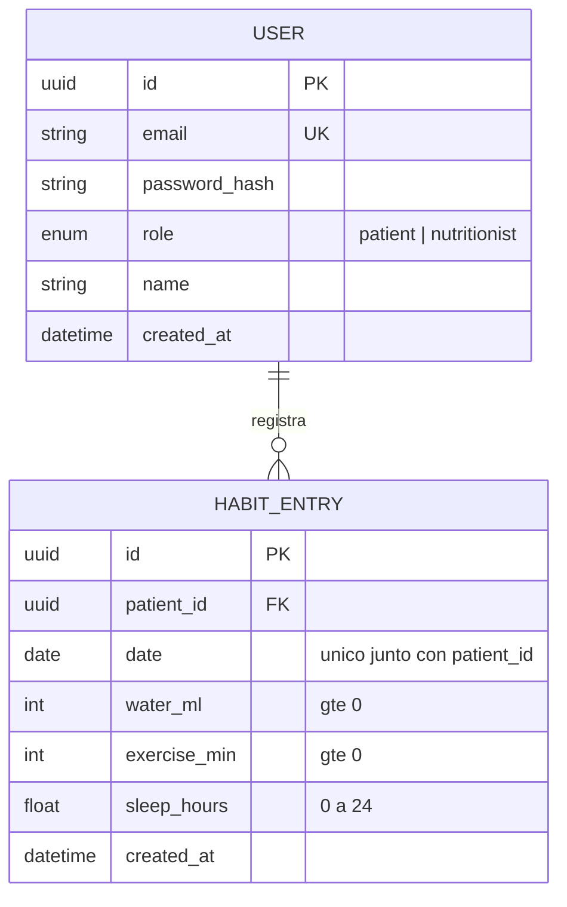

# Esquema de base de datos — NutriFit

Diagrama entidad-relación (Mermaid, renderiza nativo en GitHub). Equivalente
versionable a un diagrama de dbdiagram.io/Excalidraw.

## Decisiones del esquema

- **Sin tabla de relación paciente↔nutrióloga**: solo existe una nutrióloga en el
  sistema (creada por seed). Cualquier `User` con `role = patient` es, por
  definición, su paciente. Si en el futuro hay múltiples nutriólogas, esto necesita
  una tabla `Assignment` — no existe hoy porque no la pide el SPEC actual.
- **`(patient_id, date)` único**: la base de datos es la última línea de defensa
  contra duplicados del mismo día, incluso si la lógica de aplicación fallara.
- **`date` como `@db.Date`** (no `DateTime` con hora): un hábito pertenece a un día
  calendario, no a un instante. Ver ADR-002 sobre la limitación de timezone que
  esto implica en la capa de presentación.
