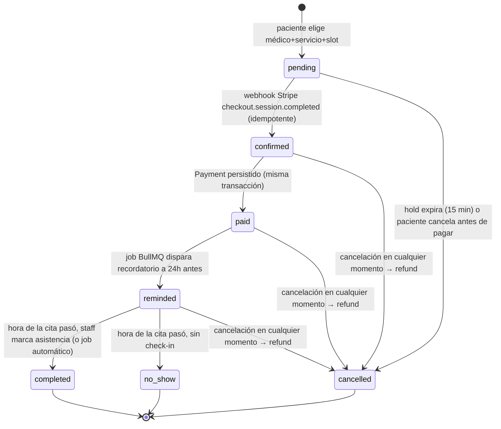

# SPEC — Vitalis Clinic (Challenge 3: "Operación clínica")

> Reemplaza el SPEC.md de Challenge 2 (NutriFit, dominio de hábitos). Se reusa la
> infraestructura del backend (Fastify + TS estricto + Prisma + Postgres, patrón de
> auth JWT, formato de errores HTTP, `content/es.json` como diccionario de mensajes)
> pero el dominio cambia por completo: de hábitos de pacientes a citas médicas con
> cobro en línea.

## Objetivo

Plataforma de reserva de citas para una clínica ficticia. Un paciente elige médico,
servicio y horario disponible, paga en línea con Stripe, recibe confirmación por
email y un recordatorio 24h antes. El staff de la clínica administra citas desde un
panel: verlas, cancelarlas (con reembolso), ver el log de eventos de cada una.

El foco del challenge no es el CRUD — es que el sistema no se caiga ni se corrompa
cuando algo falla: un webhook llega duplicado, el email rebota, Redis se cae, el
reembolso falla.

## Stack

- **Backend**: Fastify + TypeScript estricto + Prisma + PostgreSQL (heredado de Ch2)
- **Colas**: BullMQ + Redis
- **Pagos**: Stripe (test mode) — Checkout Sessions + webhooks
- **Email**: Resend
- **Error tracking**: Sentry
- **Logging**: pino, estructurado, con `request_id` propagado end-to-end
- **Validación**: Zod en cada endpoint

## Roles

| Rol | Puede |
|---|---|
| `patient` | Ver médicos/servicios/disponibilidad, crear citas, pagar, cancelar sus propias citas |
| `doctor` | Ver su propia agenda (fuera de alcance del MVP: gestionar su propia disponibilidad vía UI — se configura por seed/admin) |
| `staff` | Panel admin: ver todas las citas, cancelarlas (con refund), ver log de eventos |

## Modelo de datos

### User (se mantiene la tabla, cambia el enum de roles)

| Campo | Tipo | Notas |
|---|---|---|
| id | uuid | PK |
| email | string | único |
| passwordHash | string | bcrypt |
| role | enum | `patient` \| `doctor` \| `staff` |
| name | string | |
| createdAt | datetime | |

### DoctorAvailability

Rango recurrente semanal por médico. Los slots concretos **no se persisten**, se
calculan restando las citas ya ocupadas.

| Campo | Tipo | Notas |
|---|---|---|
| id | uuid | PK |
| doctorId | uuid | FK → User (role doctor) |
| dayOfWeek | int | 0–6 |
| startTime | string | `"HH:mm"` |
| endTime | string | `"HH:mm"` |
| slotDurationMin | int | tamaño de slot, ej. 30 |

### Service

| Campo | Tipo | Notas |
|---|---|---|
| id | uuid | PK |
| name | string | ej. "Consulta general" |
| durationMin | int | debe caber en un slot del médico |
| priceCents | int | > 0, moneda MXN |

### Appointment

| Campo | Tipo | Notas |
|---|---|---|
| id | uuid | PK |
| patientId | uuid | FK → User |
| doctorId | uuid | FK → User |
| serviceId | uuid | FK → Service |
| startsAt | datetime | inicio del slot |
| endsAt | datetime | calculado de `startsAt + service.durationMin` |
| status | enum | `pending` \| `confirmed` \| `paid` \| `reminded` \| `completed` \| `cancelled` \| `no_show` |
| holdExpiresAt | datetime? | solo mientras `status = pending` |
| stripePaymentIntentId | string? | null hasta que el webhook (o reconciliación) confirma el pago — Stripe no lo asigna al crear el Checkout Session, solo cuando el cliente llega a pagar |
| stripeCheckoutSessionId | string? | se asigna al crear la cita, siempre presente salvo que Stripe haya fallado (ver matriz de errores) |
| createdAt / updatedAt | datetime | |

Constraint: no puede haber dos citas del mismo `doctorId` con rangos `[startsAt,
endsAt)` solapados en estados `pending` (no expirado), `confirmed`, `paid`,
`reminded` — se valida en transacción al crear.

### Payment

| Campo | Tipo | Notas |
|---|---|---|
| id | uuid | PK |
| appointmentId | uuid | FK → Appointment, único |
| stripePaymentIntentId | string | único |
| amountCents | int | |
| status | enum | `succeeded` \| `refunded` \| `refund_failed` |
| stripeRefundId | string? | |
| createdAt | datetime | |

### AppointmentEvent (log inmutable, append-only)

| Campo | Tipo | Notas |
|---|---|---|
| id | uuid | PK |
| appointmentId | uuid | FK → Appointment |
| type | string | `created`, `payment_confirmed`, `payment_recorded`, `reminder_sent`, `reminder_failed`, `cancelled`, `refund_issued`, `refund_failed`, `completed`, `no_show`, `hold_expired` |
| payload | json? | detalle libre (ej. error de Stripe) |
| createdAt | datetime | |

### WebhookEvent (idempotencia de Stripe)

| Campo | Tipo | Notas |
|---|---|---|
| id | uuid | PK |
| stripeEventId | string | único — es la clave de idempotencia |
| type | string | ej. `payment_intent.succeeded` |
| processedAt | datetime | |

Diagrama entidad-relación: ver [`docs/db-schema.md`](docs/db-schema.md) (pendiente
de dibujar en Excalidraw/dbdiagram.io antes de migrar).

## Diagrama de estados de la cita

Reglas:
- `pending` es un hold temporal (TTL 15 min) — no una reserva firme. Libera el slot
  si no llega el webhook de pago a tiempo (job de expiración).
- El único disparador de `pending → confirmed` es el webhook de Stripe. Nunca se
  confía en el redirect del navegador tras el checkout.
- `confirmed → paid` ocurre en la misma transacción DB que procesa el webhook; se
  registran como dos `AppointmentEvent` distintos para trazabilidad.
- Cancelación posible desde `confirmed`, `paid` o `reminded`. Si había pago
  (`paid` o posterior), cancelar dispara un refund vía Stripe **antes** de mover el
  estado. Si el refund falla, la cita permanece en su estado actual y se registra
  `refund_failed` — no se pierde ni se cancela a medias.
- `completed` / `no_show` se resuelven por un job posterior a `endsAt`, o
  manualmente por staff desde el panel admin.

## Matriz de error paths

| Falla | Manejo |
|---|---|
| Stripe caído al crear el Checkout Session | La cita `pending` no se crea (transacción atómica); 503 al cliente |
| Webhook duplicado (mismo `event.id`) | `WebhookEvent.stripeEventId` con constraint único; segundo intento responde 200 sin reprocesar |
| Webhook nunca llega | Job de reconciliación (cada 5 min) consulta en Stripe los Checkout Sessions de citas `pending` viejas (por `stripeCheckoutSessionId`, no por `stripePaymentIntentId` — ese puede seguir null) y corrige el estado |
| Refund falla al cancelar | Estado no cambia; `AppointmentEvent` tipo `refund_failed`; reintento con backoff; visible en panel admin |
| Redis caído (no se puede encolar) | La request principal (crear cita, procesar webhook) no depende del encolado exitoso para responder; se loguea el fallo del `add()` por separado |
| Email rebota | Reintento 3 veces con backoff exponencial (BullMQ); después se marca `reminder_failed` / `notification_failed`, la cita sigue su ciclo normal |

## Endpoints

### `GET /doctors` — lista médicos activos con sus servicios asociados
### `GET /doctors/:id/availability?date=YYYY-MM-DD` — slots libres de ese día (JWT `patient`)
### `POST /appointments` — Body `{ doctorId, serviceId, startsAt }`. Crea `pending` + hold. 201 → `{ appointment, checkoutUrl }`. 409 si el slot ya no está libre. Requiere JWT `patient`.
### `POST /webhooks/stripe` — verifica firma, idempotente por `stripeEventId`. Sin JWT (autenticado por firma Stripe). 200 siempre que la firma sea válida (incluso si ya se procesó).
### `POST /appointments/:id/cancel` — Requiere JWT (`patient` dueño de la cita, o `staff`). Dispara refund si aplica. 409 si ya está `completed`/`cancelled`/`no_show`.
### `GET /appointments/me` — Requiere JWT `patient`. Sus propias citas.
### `GET /admin/appointments?status=&date=` — Requiere JWT `staff`. Todas las citas.
### `GET /admin/appointments/:id/events` — Requiere JWT `staff`. Log de eventos de una cita.

## Manejo de errores HTTP

Mismo formato que Ch2: `{ error: string, statusCode: number }`, nunca stack trace.

| Código | Cuándo |
|---|---|
| 400 | Body no cumple Zod |
| 401 | No autenticado |
| 403 | Rol sin permiso sobre el recurso |
| 404 | Recurso no existe |
| 409 | Conflicto de estado (slot ocupado, cita ya cancelada) |
| 422 | Bien formado pero viola regla de negocio |
| 503 | Proveedor externo (Stripe) no disponible al crear el checkout |

## Colas (BullMQ)

| Cola | Job | Retry |
|---|---|---|
| `hold-expiry` | expira `pending` sin pago a los 15 min | sin retry (idempotente: solo actúa si sigue `pending`) |
| `reminders` | envía email de recordatorio a `startsAt - 24h` | 3 intentos, backoff exponencial (1min, 5min, 15min), luego `reminder_failed` |
| `notifications` | email de confirmación al pasar a `paid` | igual que reminders |
| `reconciliation` | cada 5 min, revisa Checkout Sessions de citas `pending` colgadas | sin retry (se repite en el próximo tick) |

Ver [ADR-007](docs/adr/ADR-007-webhook-idempotency.md) y
[ADR-008](docs/adr/ADR-008-retry-strategy.md).

## Fuera de alcance para esta entrega

- El médico gestionando su propia disponibilidad vía UI (se siembra por seed).
- Reagendar cita (queda para el "PR contra reloj" del challenge).
- Integración con Google Calendar / WhatsApp (stretch goals).

## Deploy

Pendiente — se documentará junto con el runbook una vez el flujo end-to-end esté
verificado localmente con Stripe CLI (`stripe listen --forward-to`).
