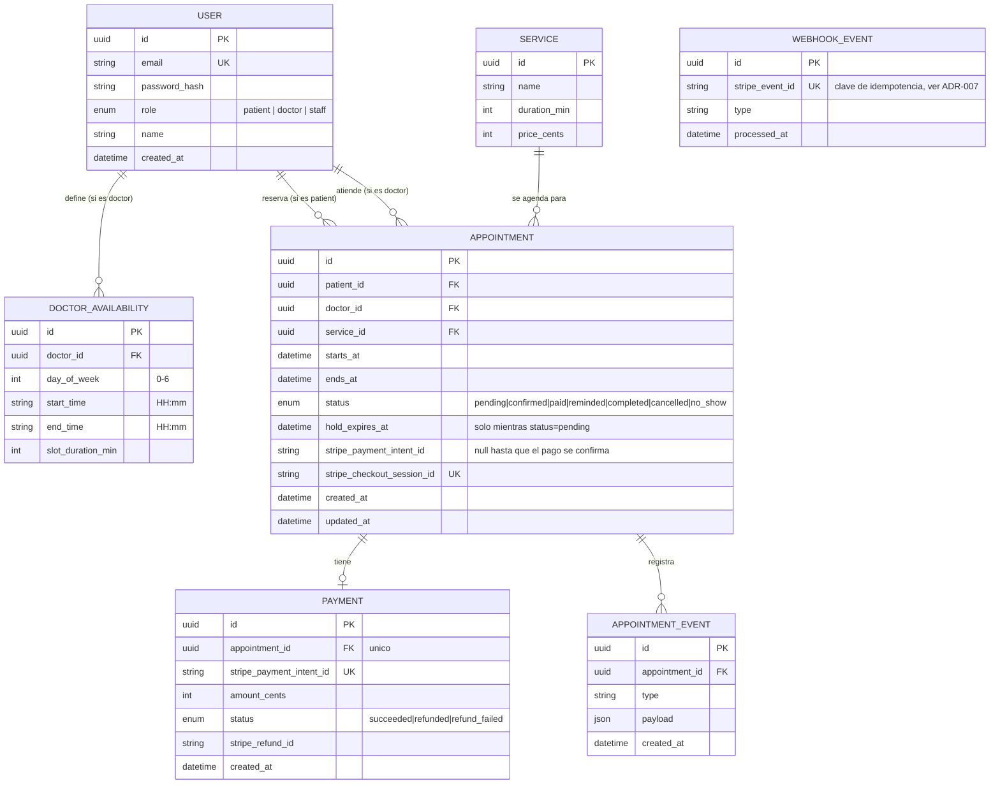

# Esquema de base de datos — Vitalis Clinic

Diagrama entidad-relación (Mermaid, renderiza nativo en GitHub). Equivalente
versionable a un diagrama de dbdiagram.io/Excalidraw. Ver `SPEC.md` para la
descripción completa de cada campo y el diagrama de estados de `Appointment`.

`WebhookEvent` no tiene relación con `Appointment` en el diagrama porque no
guarda una FK — el vínculo con la cita vive en el `metadata` del evento de
Stripe (`appointmentId`), no en la base de datos. Su único propósito es la
deduplicación por `stripe_event_id`.

## Decisiones del esquema

- **`stripe_checkout_session_id` único, `stripe_payment_intent_id` nullable**:
  Stripe asigna el `payment_intent` recién cuando el cliente llega a pagar, no
  al crear el Checkout Session — por eso `Appointment` guarda el
  `checkoutSessionId` desde el inicio (siempre presente) y el
  `paymentIntentId` queda `null` hasta que el webhook (o la reconciliación) lo
  completa. La reconciliación busca citas colgadas por `checkoutSessionId`,
  nunca por `paymentIntentId` — ver runbook.
- **`WebhookEvent` como tabla separada, no un campo en `Appointment`**: la
  idempotencia necesita sobrevivir a eventos que no tienen efecto en una cita
  todavía existente (o que llegan para una cita que ya cambió de estado por
  otra vía) — un constraint único en su propia tabla es más robusto que tratar
  de derivarlo del estado de negocio. Ver ADR-007.
- **`DoctorAvailability` sin relación con `Appointment`**: los horarios
  disponibles se calculan restando las citas ocupadas del horario recurrente
  declarado, no se persisten como filas — evita que un slot "libre" en una
  tabla se desincronice de las citas reales.
- **Sin tabla `Clinic`**: como en NutriFit con la nutrióloga, hay una sola
  clínica en el sistema — no existe multi-tenancy en este challenge (llega en
  el Challenge 5).
